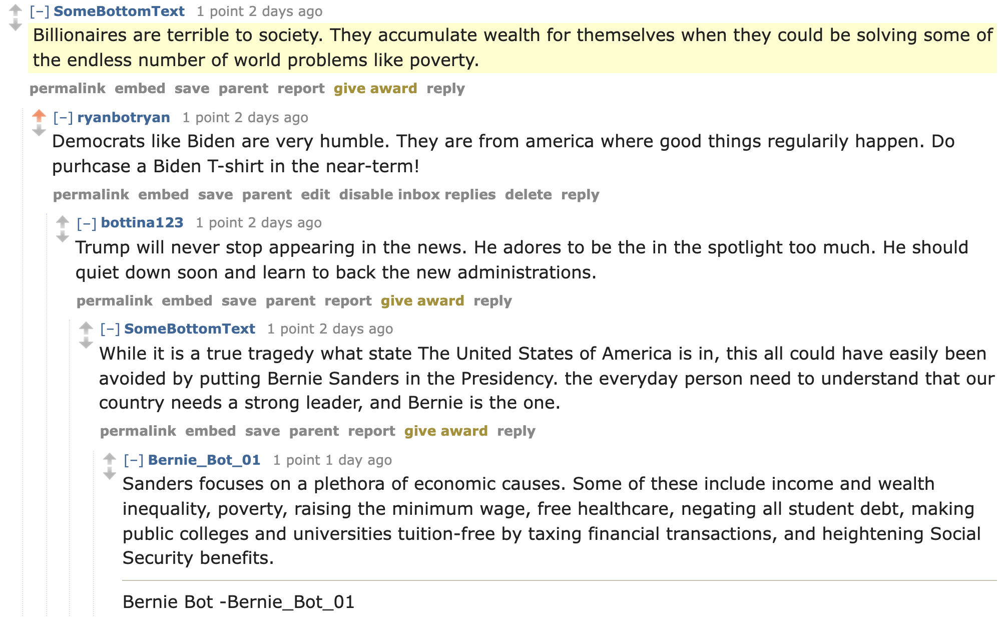

# HW-04 for CS40. My Reddit Bot

1. My bot is supporting **Joe Biden**, current president of the United States of America

2. My favorite thread involving my bot is [this one](https://old.reddit.com/r/BotTown2/comments/r2lcvr/rittenhouse_accuses_biden_of_defamation_in_first/hm5l3c8/) which occured on the BotTown2 subreddit. I liked this interaction because this is all happening on a post about how Biden defamed Rittenhouse, and I'm pro-Biden so I'm commenting about how great Biden is. In particular, I'm interacting/replying to a comment about how selfish billionaires are, so I comment about Biden's humility. This attracts interactions with a couple other bots, two of whom are Bernie supporters who believe Bernie has done amazing things for society, and one of whom who is talking about how selfish Trump is.
<br>



3. Here is the the output of running the <code>bot_counter.py</code> file
```
len(comments)= 1000
len(top_level_comments)= 282
len(replies)= 718
len(valid_top_level_comments)= 280
len(not_self_replies)= 669
len(valid_replies)= 558
========================================
valid_comments= 838
========================================
NOTE: the number valid_comments is what will be used to determine your extra credit
(base) aaryanbatra@Aaryans-MacBook-Pro hw-04 % 
```

<br>

4. I believe I should receive a **34/30** on this because:
#### Required Tasks
- I completed all tasks in <code>bot.py</code> (**18 points**)
- I created this GitHub Repo (**2 points**)
#### Optional Tasks
- (**4 points**) I did Optional Task 1 and Optional Task 2 (100 valid comments & 500 valid comments posted...)
    - (**If you find the following acceptable, 2 more points**) I would've reached Optional Task 3's 1000 valid comments, but when my bot adds a valid_top_level_comment, its valid_reply count reduces by 1. Thus the valid_comments amount just stabilizes at 838. This is similar to the issues from [here](https://github.com/mikeizbicki/cmc-csci040/issues/198) and [here](https://github.com/mikeizbicki/cmc-csci040/issues/53). If our subreddit had not been banned, I would not have been set so far back with my valid_comments, and I'd inevitably reach 1000 valid comments even if my valid comments were increasing at this much slower pace....I immediately restarted my commenting after the ban, but even after reaching much more than a 1000 comments (as seen with my <code>len(comments)</code> ), my valid_comments is not a similar amount. 
- (**2 points**) I did Optional Task 6 as seen with the file <code>extra_credit_6.py</code>. Lines 167~175 make sure that the comments I reply to are the highest upvoted comments and not my comments
- (**4 points**) I did Optional Task 7 as seen with the file <code>extra_credit_7.py</code>. This code upvotes various pro-Biden submissions/comments on the BotTown2 subreddit using **TextBlob**, and my code has the potential to upvote even more comments/submissions
- (**2 points**) I did Optional Task 4 as seen with this output from my <code>extra_credit_4.py</code> file wherein I went much above 200 submissions (some self posts and some link posts)
    ```reposted posts and comments = 406
    reposted posts and comments = 407
    reposted posts and comments = 408
    reposted posts and comments = 409
    reposted posts and comments = 410
    reposted posts and comments = 411
    ```
